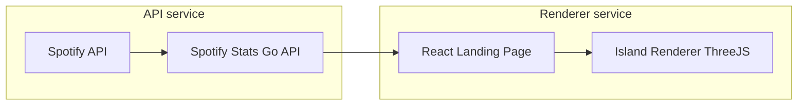

# Motivation

Recently I've discovered an interesting CLI app called cliamp, which allows me to use Spotify in terminal. While setting up this app, I've needed to set my Spotify API 
to use it, then, suddenly I've got an idea, what if I try to make an app using Spotify statistics? It's a free API anyway, and I could also use that to learn more about ThreeJS, which is a
library I've been looking for an excuse to learn for a long time.

# Idea
I want to do the following in this project:
- A service to get the data from Spotify API and build some statistics about the user's most listened artists.
- A frontend using React, really simple just for inputting stuff.
- A ThreeJS interactive ocean with clusters of islands based on what the person listens to, with procedural generation based on the data received from the API.

**Important info:** I want each piece of this to do one thing well, I don't want the API data to do anything but what it was made to do, so it doesn't need to know that it's going to be used 
for a procedural island map, it should work with ANY project that would use Spotify API to generate relationship between most listened artist, would that be a last.fm like app or a simple first web project, long live the unix philosophy in the age of spaghetti AI slop!!

## Main blocks of the project
I think it is important to decide the roles of each part of the project, even though I will not do so much of structured planning in the next parts, I still think that 
the definition of the roles and scope of the blocks and system is way too important to just "discover later", so I've come up with the following flux:

So, I'll divide it now into repos and sections to explain what each will do:

### Spotify Stats
This will be a simple API made in Go, with:
- Fiber for API handling.
- Huma for visual API docs.
It should be kept simple
- Spotify Auth handling, with login in the browser to keep it easy.
- Endpoint to get the data from the top artists/songs from the person (already made by Spotify API).
- Endpoint to get user data, like name and picture.
- Endpoints for different sorts of statistics:
  - How close the artists/songs from the top listened are from each other based on genre.
  - Distance of how popular each artists/songs is.
  - Distance by colour of the album, using the cover image as a basis.
Unfortunately, I can't compare two people's Spotify usage, unless I store the data in a server, and that won't happen, at least for now MUAHAHAHA

### Frontend Island Renderer
#### React Landing Page
This will probably be the shortest part of the project, it will only have a screen explaining the project in a landing page with a button to log in to Spotify, after that, it will go to 
the ThreeJS canvas.
Some of navigation UI will be done with ThreeJS, so React will be used just for the landing page, showing examples and guiding the user a bit.

#### Island Renderer ThreeJS
This will be the most fun part, where I use data from the Spotify Stats to build the islands!!

Using the payload received, it will create islands and clusters of islands, focusing not in the distance between them, but HOW to render the distances received by the API, the focus 
of this service will be pretty much on rendering islands and creating an interactive map based on an favorite game of mine, The Legend of Zelda: The Wind Waker, I won't plan for now how I'll render it, but
some of my main objectives for this are:
- Create an algorithm that takes distances and create an ocean and islands based on these distances.
- Create hover images for the albums.
- Zoom out "magic" map with sky view and an option leading to an general labeling of zones, like "Rock", "Classical" and etc, removing the islands rendering and only keeping the silhouette for simpler view.
- A way to traverse the map using a tiny boat with the user's Spotify picture.
- Ocean shader to simulate waves with FFT.
- Cel shading shader, just for style!!!
---
And that's about it!! I hope to learn a lot with this project and hope at least some people can follow along with this weird fun side project.

